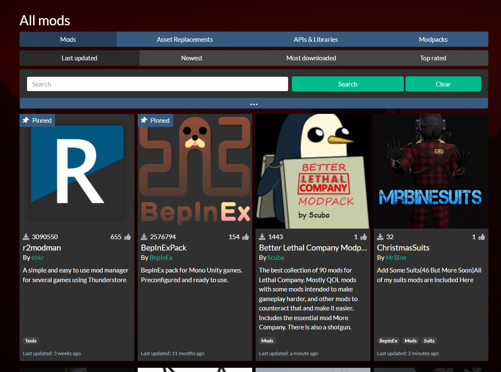
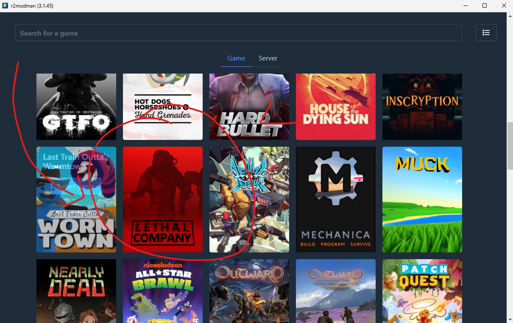
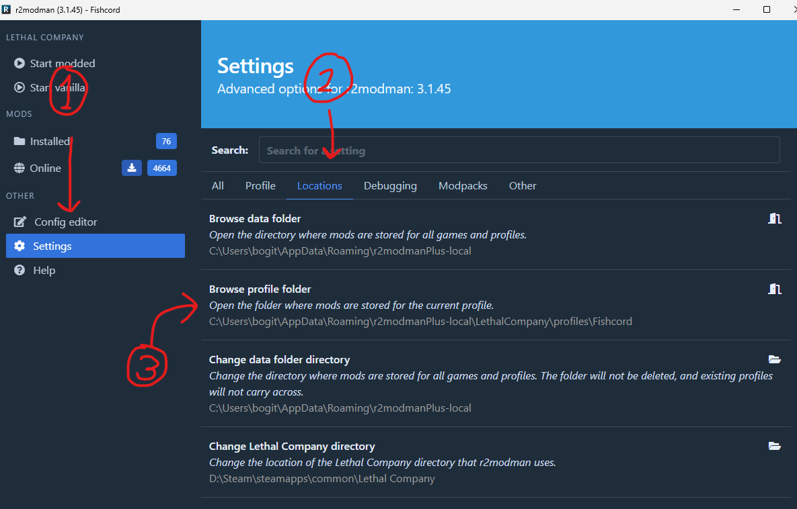
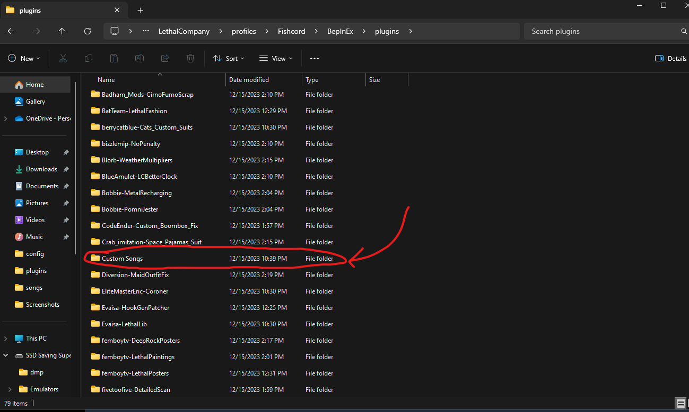

**WHEN CLICKING LINKS OPEN THEM IN A NEW TAB TO AVOID LEAVING THIS PAGE**  
(you can do this by middle mouse clicking or right clicking and selecting open in new tab)
[Try here and continue](https://www.youtube.com/watch?v=dDzACwItLoY)  
  
Downloading the R2ModMan Launcher
---
First you need to download the manager its called **r2modman**
[Link to Store](https://thunderstore.io/c/lethal-company/)
  

Extract the contents of the zip when downloading to a some folder it dont matter what just make an empty for ease.
Click on **r2modman Setup (some version nuber).exe**  

Find Lethal Company and select it
  

Click on <Import/Update --> Import New Profile --> From Code>
Then paste this code **018c717e-4b69-a963-c7dd-def7572c4c41**  
Now launch the hit start modded in the top right cornor wait for the main menu to show up and close the game and go back to modman (the game may crash once or twice upon inital launch just keept tryin) 
  
Go to [this](https://drive.google.com/drive/folders/1RBKf-UG_68ISVJft_lltWjYvhtQ4brZO?usp=drive_link) google drive and downlaod the song list we have  

In modman go to these sections  
  
and go to <bepinx --> plugins --> custom songs> it should be empty  

Now just unzip the song list you downloaded into the **custom song** folder and ur done  
While your here go to the bottom of the plugins folder and click **x753-More_Suits** and drag the moresuits folder into the plugins folder

Updating the mod list
---
erm just hit update mods if the modman tells ya  
and if I add mods I'll just change the code and you can just update profile instead of importing one
